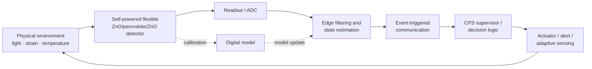

# Self-Powered Flexible Photodetector Cyber-Physical System

[](https://github.com/Hirakhyzer/self-powered-flexible-photodetector/actions/workflows/ci.yml)


A reproducible research framework for a **self-powered flexible ZnO/perovskite/ZnO photodetector integrated as the sensing layer of a Cyber-Physical System (CPS)**. The project combines coupled piezoelectric–pyroelectric device simulation with edge intelligence, event-triggered communication, network disturbances, system-state estimation, and closed-loop actuator commands.

> **Research-status notice:** the repository contains a physics-inspired reduced-order device model and synthetic CPS/network simulations. It does **not** claim a fabricated detector, measured device performance, validated embedded electronics, measured network performance, or a certified control/safety system. Quantitative parameters must be calibrated using experiments or trusted literature before scientific or engineering deployment.

## Project idea

The physical research target is a flexible ZnO/perovskite/ZnO heterostructure operated at zero external electrical bias. Light generates photocarriers, while mechanical strain and thermal transients can alter the modeled interface polarization through piezoelectric and pyroelectric terms.

The CPS extension moves beyond an isolated sensor. Detector current becomes a physical signal that is processed by an edge node, converted into system states, transmitted through a configurable communication channel, and mapped to a closed-loop action.

This enables a broader research question:

**How can a self-powered multifunctional photodetector be co-designed with computation, communication, resilience, and control to form an energy-aware cyber-physical sensing system?**

## CPS architecture



The current software implements the detector, edge, network, and supervisory parts in simulation. The actuator is represented by a command code so the physical-to-cyber-to-action path is explicit and can later be replaced by hardware.

See [`docs/CPS_ARCHITECTURE.md`](docs/CPS_ARCHITECTURE.md) for the system design and hardware-in-the-loop pathway.

## What this repository provides

### Physical layer

- Reduced-order zero-bias ZnO/perovskite/ZnO detector model.
- Baseline photovoltaic response.
- Piezoelectric strain-dependent interface modulation.
- Pyroelectric temperature-transient contribution.
- Coupled carrier-separation gain.
- Responsivity, EQE, photocurrent, and shot-noise-limited detectivity calculations.
- Time-domain chopped-light simulation and parameter sweeps.

### Cyber layer

- Exponential edge filtering of detector current.
- CPS state classification: `IDLE`, `MONITOR`, `PROTECT`, `FAULT`.
- Mechanical- and thermal-limit detection.
- Event-triggered telemetry plus heartbeat messages.
- Configurable packet loss and communication latency.
- Closed-loop actuator command codes.
- System-level metrics such as state occupancy, transitions, requested packets, delivered packets, and delivery ratio.

### Research engineering

- Reproducible JSON configurations.
- CSV/PNG result generation.
- Unit tests and GitHub Actions CI.
- Device experiment protocol.
- CPS architecture documentation.
- PhD-oriented research roadmap from device physics to hardware-in-the-loop CPS validation.

## Repository structure

```text
self-powered-flexible-photodetector/
├── configs/
│   ├── baseline.json            # Device/physical simulation parameters
│   └── cps_demo.json            # Edge/network/controller parameters
├── data/                        # Raw/processed experimental data
├── docs/
│   ├── MODEL.md                 # Reduced-order device model
│   ├── EXPERIMENT_PROTOCOL.md   # Physical-device validation
│   ├── CPS_ARCHITECTURE.md      # CPS design + HIL pathway
│   └── RESEARCH_ROADMAP.md      # Device → CPS research plan
├── examples/
├── results/                     # Generated outputs
├── scripts/
│   ├── run_simulation.py        # Physical detector simulation
│   ├── run_sweep.py             # Parameter sweeps
│   └── run_cps_demo.py          # End-to-end CPS simulation
├── src/flexpd/
│   ├── model.py                 # Physical model
│   ├── metrics.py               # Photodetector metrics
│   ├── cps.py                   # Cyber/network/decision layer
│   └── io.py
├── tests/
├── .github/workflows/ci.yml
├── pyproject.toml
└── README.md
```

## Quick start

```bash
git clone https://github.com/Hirakhyzer/self-powered-flexible-photodetector.git
cd self-powered-flexible-photodetector
python -m venv .venv
source .venv/bin/activate        # Windows: .venv\Scripts\activate
pip install -e ".[dev]"
```

Run tests:

```bash
pytest
```

## 1. Run the physical detector model

```bash
python scripts/run_simulation.py \
  --config configs/baseline.json \
  --out results/baseline
```

Run a strain sweep:

```bash
python scripts/run_sweep.py \
  --config configs/baseline.json \
  --parameter strain \
  --start -0.01 \
  --stop 0.01 \
  --points 41 \
  --out results/strain_sweep.csv
```

## 2. Run the Cyber-Physical System demo

```bash
python scripts/run_cps_demo.py \
  --config configs/baseline.json \
  --cps-config configs/cps_demo.json \
  --out results/cps_demo
```

The CPS demo generates:

```text
results/cps_demo/
├── cps_timeseries.csv
├── cps_summary.json
└── cps_overview.png
```

`cps_timeseries.csv` contains the physical detector signal together with filtered current, strain, thermal rate, CPS state, actuator command, telemetry request, packet delivery, and simulated packet-arrival time.

## CPS state machine

| Code | State | Meaning in the current demo |
|---:|---|---|
| 0 | `IDLE` | No configured event threshold is exceeded |
| 1 | `MONITOR` | Filtered detector current exceeds the configured event threshold |
| 2 | `PROTECT` | Mechanical strain or thermal-rate limit is exceeded |
| 3 | `FAULT` | A required sensor value is non-finite |

The thresholds in `configs/cps_demo.json` are illustrative research inputs. They are not medical, industrial, or safety limits.

## Physical model overview

### Baseline photovoltaic response

The unity-gain responsivity is calculated from external quantum efficiency \(\eta\):

\[
R_0 = \eta \frac{q\lambda}{hc}.
\]

### Piezoelectric modulation

An effective strain-dependent interface potential is represented by a calibrated coefficient. The sign and magnitude of strain therefore influence the modeled interfacial polarization.

### Pyroelectric contribution

The transient pyroelectric current is represented as

\[
I_{pyro}=pA\frac{dT}{dt},
\]

where \(p\) is an effective pyroelectric coefficient and \(A\) is active area.

### Coupled gain

The effective polarization potential modulates the baseline zero-bias photocurrent using a bounded phenomenological exponential gain. This term is intentionally simple and should be fitted to measured data.

### Detectivity

The repository provides a shot-noise-limited estimate:

\[
D^*=\frac{R\sqrt{A}}{\sqrt{2qI_{dark}}}.
\]

This can be optimistic when other noise sources are important.

See [`docs/MODEL.md`](docs/MODEL.md) for assumptions and limitations.

## CPS research directions

The combined platform supports questions at the device–system boundary:

- How can the edge layer distinguish optical events from piezoelectric and pyroelectric transients?
- Can event-triggered communication reduce telemetry load without missing important physical events?
- How do packet loss and latency change physical-event-to-action response?
- Can strain and thermal information improve context-aware interpretation of optical measurements?
- Can model residuals reveal device drift, delamination, aging, or readout faults?
- How should uncertainty in responsivity and polarization parameters propagate into CPS decisions?
- Which computations should run locally versus at a gateway or supervisory node?
- How can a self-powered sensing element reduce system-level energy demand when communication and computation are also considered?
- How resilient is the system to sensor faults, missing data, replayed measurements, or communication outages?

## Hardware-in-the-loop target

The simulation is designed so the physical stream can eventually be replaced by real measurements:

```text
flexible photodetector
    → low-noise analog front-end
    → ADC / microcontroller
    → edge filtering + state estimator
    → experimental communication link
    → CPS supervisor
    → actuator / alert / adaptive sampling
```

A hardware-in-the-loop study should measure end-to-end latency, noise, sampling jitter, packet behavior, energy consumption, state-estimation accuracy, and actuator response rather than relying on assumed values.

## Experimental programme

Physical validation should compare at least:

- dark vs illuminated operation at zero bias;
- flat vs tensile/compressive bending;
- steady temperature vs controlled heating/cooling transients;
- uncoupled controls vs the full ZnO/perovskite/ZnO structure.

CPS validation should then add:

- calibrated analog readout and ADC acquisition;
- embedded processing timing;
- periodic vs event-triggered communication;
- measured link latency/loss;
- sensor drift/fault injection;
- safe behavior during network outages;
- hardware-in-the-loop closed-loop response.

See [`docs/EXPERIMENT_PROTOCOL.md`](docs/EXPERIMENT_PROTOCOL.md) and [`docs/RESEARCH_ROADMAP.md`](docs/RESEARCH_ROADMAP.md).

## Literature anchors for the physical-device concept

These papers provide context for the physical-device direction; they do not validate the exact CPS architecture or the exact ZnO/perovskite/ZnO HBPT concept implemented here.

1. *A high-performance self-powered broadband photodetector based on vertical MAPbBr3/ZnO heterojunction*, Materials Science in Semiconductor Processing 169 (2024) 107943. DOI: `10.1016/j.mssp.2023.107943`.
2. G. Hu et al., *Enhanced performances of flexible ZnO/perovskite solar cells by piezo-phototronic effect*, Nano Energy 23 (2016) 27–33. DOI: `10.1016/j.nanoen.2016.02.057`.
3. *Light-Triggered Pyroelectric Nanogenerator Based on a pn-Junction for Self-Powered Near-Infrared Photosensing*, ACS Nano (2017). DOI: `10.1021/acsnano.7b03560`.
4. *Pyro-Phototronic Effect-Enhanced Photocurrent of a Self-Powered Photodetector Based on ZnO Nanofiber Arrays/BaTiO3 Films*, ACS Applied Materials & Interfaces 15 (2023) 46031–46040. DOI: `10.1021/acsami.3c08880`.

## Reproducibility and scientific integrity

- Keep raw measurements immutable under `data/raw/`.
- Record device ID, geometry, illumination wavelength/power, strain/bend radius, temperature history, instrument settings, sampling rate, network configuration, and firmware/software version.
- Report measured values separately from fitted or illustrative parameters.
- Do not present synthetic detector or network outputs as measurements.
- Add uncertainty estimates and repeat-device statistics before drawing performance conclusions.
- Treat CPS thresholds and actuator policies as experimental design variables until validated for a defined application.

## Project status

**v0.2 — CPS research scaffold**

The repository now spans both the physical photodetector model and the cyber layer needed for end-to-end CPS experiments. The next major milestone is calibration with real detector data followed by hardware-in-the-loop integration.

## Contributing

Research contributions are welcome through issues and pull requests. New physical parameters should include units and provenance; new CPS logic should document assumptions, failure modes, and validation tests.

## Citation

If this repository contributes to academic work, cite the specific release/commit used and cite the primary experimental sources supporting any material or device parameters.
