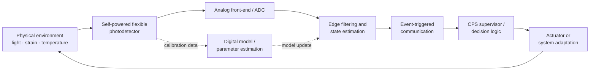

# Cyber-Physical System Architecture

## Purpose

This repository now treats the self-powered flexible ZnO/perovskite/ZnO photodetector as the **physical sensing element of a cyber-physical system (CPS)** rather than as an isolated device model. The CPS research objective is to co-design sensing physics, embedded inference, communications, resilience, and closed-loop responses.

The current implementation is a research scaffold. It does not claim that the illustrated controller, thresholds, latency, network loss, or actuator policy are validated for a deployed system.

## System loop



## Mapping from device physics to CPS functions

| Layer | Repository representation | Research role |
|---|---|---|
| Physical process | Light, strain, and thermal transients | Environment interacting with the sensor |
| Transduction | `src/flexpd/model.py` | Coupled photovoltaic, piezoelectric, and pyroelectric response |
| Edge computation | `src/flexpd/cps.py` | Filtering, event classification, health/fault state |
| Communication | `src/flexpd/cps.py` | Event-triggered telemetry, packet loss, latency |
| Decision | CPS state machine | `IDLE`, `MONITOR`, `PROTECT`, `FAULT` |
| Actuation | Actuator command code | Placeholder for warning, haptic, shutdown, adaptive sensing, etc. |
| Digital model | Device + operating parameters | Calibration, prediction, sensitivity and eventual digital-twin work |

## CPS state policy

The current demo deliberately uses an inspectable state machine:

- `IDLE`: no event threshold is exceeded.
- `MONITOR`: filtered photodetector current exceeds the configurable event threshold.
- `PROTECT`: mechanical strain or thermal-rate limits are exceeded.
- `FAULT`: a required sensor value is non-finite.

The actuator command currently mirrors the state. This makes the end-to-end physical-to-cyber-to-action path explicit without pretending that a specific actuator has already been engineered.

## Event-triggered communication

The edge layer processes each input sample locally. Communication is reduced by transmitting:

1. every non-IDLE event sample;
2. every state transition; and
3. periodic heartbeat samples during IDLE periods.

The model includes configurable packet loss and fixed communication latency. These are synthetic network parameters used to study system behavior and should not be interpreted as measurements of a real radio or network.

## Why this is useful for CPS research

The detector is affected simultaneously by optical, mechanical, and thermal conditions. A CPS layer can use those coupled signals not only for sensing but also for context-aware decisions. This creates research questions that cannot be answered by device characterization alone, such as:

- How should the edge node distinguish useful optical events from piezo/pyro transients?
- Can event-triggered telemetry reduce communication load without missing safety-relevant events?
- How sensitive is the closed-loop decision to packet loss and network latency?
- When should the system increase sampling/communication because sensor conditions become uncertain?
- Can model residuals reveal device degradation, delamination, thermal drift, or readout faults?
- How should uncertainty from the physical detector propagate into cyber decisions?

## Hardware-in-the-loop pathway

A future hardware-in-the-loop testbed can replace the simulated physical stream with real measurements while keeping the cyber layer unchanged:

```text
ZnO/perovskite/ZnO device
        ↓
transimpedance amplifier / low-noise readout
        ↓
ADC + microcontroller
        ↓
edge filtering / event classifier
        ↓
BLE, Wi-Fi, LoRa, wired serial, or another experimental link
        ↓
gateway / supervisory controller
        ↓
actuator, alert, adaptive sampling, or application logic
```

The specific electronics and communication technology should be selected from measured current range, bandwidth, noise, power budget, latency requirements, and the intended application.

## Resilience and security extension

CPS research also requires distinguishing physical faults from cyber/network faults. Future versions can add controlled fault injection for:

- packet delay, packet loss, duplication, and reordering;
- sensor bias/drift and stuck-at faults;
- replayed or spoofed measurements;
- corrupted configuration thresholds;
- denial-of-service or communication outages.

No cybersecurity protection mechanism is claimed by the current code. These items are a roadmap for resilient-CPS experiments.

## Reproducible demo

Run:

```bash
python scripts/run_cps_demo.py \
  --config configs/baseline.json \
  --cps-config configs/cps_demo.json \
  --out results/cps_demo
```

Outputs:

- `cps_timeseries.csv` — physical measurements, cyber states, telemetry decisions, packet delivery and arrival times;
- `cps_summary.json` — state fractions, transition count and packet-delivery metrics;
- `cps_overview.png` — detector current and CPS state over time.

## Scientific interpretation

The device model, CPS thresholds, and network parameters are all configurable. Synthetic outputs are useful for software validation, sensitivity analysis, experiment design, and controller prototyping. They are not substitutes for measured detector data, measured network performance, embedded timing measurements, or application-specific safety validation.
